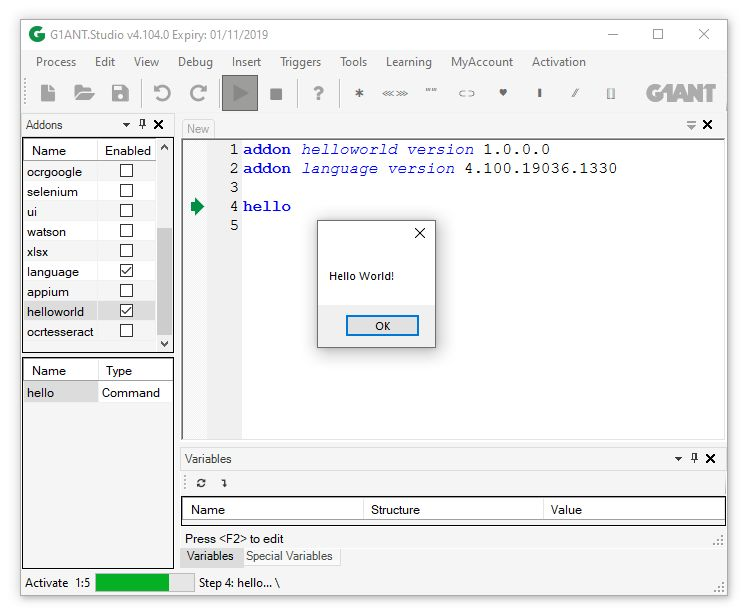
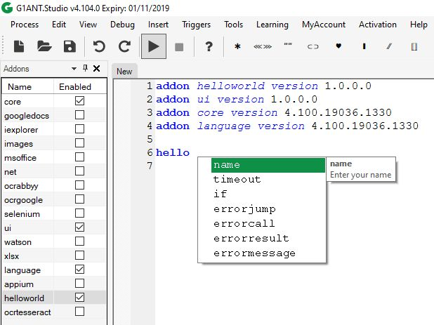
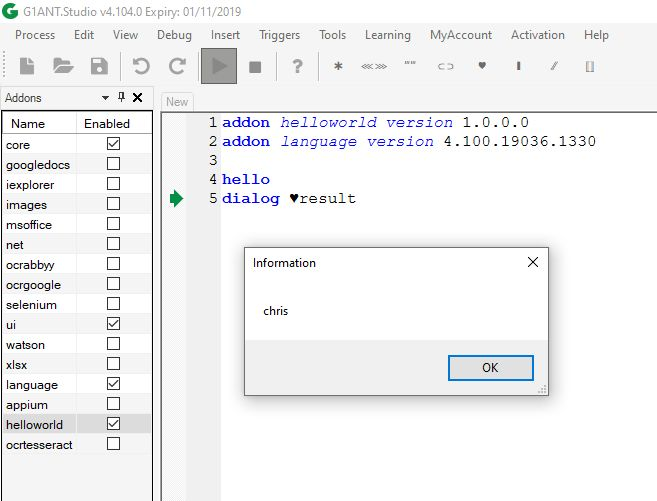

# G1ANT.Addon.Command.Hello

G1ANT.Studio is a open platform, which enable you to create new features like Commands, Structures, Compilers, Triggers, Panels and Wizards. 
In this tutorial I will show you how to create new Command in G1ANT.Studio.

First of all, you should install [G1ANT.Addon.Sdk](https://github.com/G1ANT-Robot/G1ANT.Sdk/raw/master/G1ANT.Sdk.vsix) in your Visual Studio Environment. When you are ready, let's go to the next step.

## What we need

We want the new command Hello, which 

* will display 'Hello World' dialog box on the screen if there is no parameters, 
* or 'Hello text' if there is entered any text as command parameter

As result, the command will answer date time of display operation.

## Create project

1. File -> New Project <Ctrl+Shift+N>
2. Choose **G1ANT.Robot.Addon Template** as project type and click **Next**
3. As **Project name** enter **G1ANT.Addon.HelloWorld**
4. Choose **.NET Framework 4.6.1** and click **Create**
5. When you will receive empty project, right click on the **References** -> **Manage NuGet packages**
6. If there is a message 'Some NuGet packages are missing from this solution. Click restore from your online package sources', click **Restore**
7. That's all. Your first empty addon is ready. Just click **Build** <Ctrl+B> to check.

> Note: When you build project in **Release** environment, 
> the addon will be copied into destionation **Documents/G1ANT.Robot/Add-On** directory, 
> so you should remember to close **G1ANT.Robot** program before that action.

## Prepare header

You have empty project now, and the file Addon.cs should be filled by you.

```C#
    [Addon(Name = "HelloWorld", Tooltip = "This is my example addon")]
    [Copyright(Author = "John Smith", Copyright = "John Smith", Email = "johnsmith@gmail.com", Website = "www.johnsmith.com")]
    [License(Type = "LGPL", ResourceName = "License.txt")]
```

All these information will display in the G1ANT.Studio as metadata assigned to **G1ANT.Addon.Command.Hello.dll**. 
**License.txt** will be also embeded into your addon.

When you will be ready, just close G1ANT.Robot (if open) and **Build** <Ctrl+B> your addon in **Release** environment. 
After that, execute G1ANT.Robot and check it out **Addons** panel from the menu **View**. Find **hello** and double click on that. 
You should see all header information, but the addon is empty right now. 
There is no features like Commands, Structures, Compilers, Triggers, Panels and Wizards. 

## Add Hello command

Right click on the project name **G1ANT.Addon.Command.Hello** in Visual Studio, and click **Add** -> **New Item**. Find **G1ANT.Robot** on the left, and select **G1ANT.Robot Command**, because we will create new command ```hello```. Enter **HelloCommand.cs** as class name and click **Add**. You will see **HelloCommand.cs** editor in Visual Studio.

First of all, fill the header:

```C#
    [Command(Name = "hello", Tooltip = "display hello message")]
    public class HelloCommand : Language.Command
    {
```

For now, **Name** and **Tooltip** parameters are enough, but in the future you can use also:

1. **AcceptUnlistedArguments** - it means, that your command can take additional parameters which are not specified in your **Arguments** class. You have access to these arguments by property ```Dictionary<string, object> UnlistedArguments``` from the **Arguments** class.
2. **CustomLineParse** - this command should not use standard G1ANT parsing mechanism to take arguments and executing. Use method Execute(string line) instead of ```Execute(Arguments arguments)```.
3. **IconName** - which icon should be displayed with that command. The icon should be stored as resource.
4. **NeedsDelay** - is this necessary to use delay with that command, like **keyboard** and **mouse**?

## Implement Execute method

As the method body, let's display message "Hello World".

```C#
    [Command(Name = "hello", Tooltip = "Display hello message")]
    public class HelloCommand : Language.Command
    {

        public HelloCommand(AbstractScripter scripter) :
            base(scripter)
        {
        }

        public class Arguments : CommandArguments
        {
        }

        public void Execute(Arguments arguments)
        {
            MessageBox.Show("Hello World!");
        }
    }
```

Close G1ANT.Robot.exe. Compile <Ctrl+B> this example in release environment and 
restart G1ANT.Robot.exe. 
You should see the new addon "HelloWorld" on the left. 
Select it and your command **hello** 
will be available in G1ANT.Studio intelisence and autocompletion. 

Let's use this command in the G1ANT's script:

```G1ANT
addon helloworld version 1.0.0.0
addon language version 4.100.19036.1330

hello
```

After execution you will see that message:



# Add some arguments for our command

Let's display first given argument. For example:

```G1ANT
addon helloworld version 1.0.0.0
addon language version 4.100.19036.1330

hello John
```

After robot execution we should see "Hello John!" message. Let's write some code. 
Arguments class should have one argument **Name** 
which is name of the user we would like to greet.
Take a look on the body of Execute method. When argument **Name** is empty, 
"Hello World!" will be displayed.


```C#
    [Command(Name = "hello", Tooltip = "Display hello message")]
    public class HelloCommand : Language.Command
    {
        public HelloCommand(AbstractScripter scripter) :
            base(scripter)
        {
        }

        public class Arguments : CommandArguments
        {
            [Argument(Required = false, Tooltip = "Enter your name")]
            public TextStructure Name { get; set; }
        }

        public void Execute(Arguments arguments)
        {
            if (arguments.Name == null)
                MessageBox.Show("Hello World!");
            else
                MessageBox.Show($"Hello {arguments.Name.Value}!");
        }
    }
```

Close G1ANT.Robot.exe and build <ctrl+B> addon, restart G1ANT.Robot.exe 
and try to execute "hello Max" command. First argument is optional, 
but you can see it's name and tooltip by autocompletion mechanism.



## Structures

You can use many structures from G1ANT.Language.dll or create your own 
(see G1ANT.Addon.Structure.Directory project G1ANT.Addon.Tutorials solution).

C# Structure | C# Type | G1ANT Name | Description
------------ | ------- | ---------- | -----------
[Structure](https://manual.g1ant.com/G1ANT.Addons/G1ANT.Language/Structures/Structure.md) | Object | | base class
[BooleanStructure](https://manual.g1ant.com/G1ANT.Addons/G1ANT.Language/Structures/BooleanStructure.md) | boolean | bool |
[ColorStructure](https://manual.g1ant.com/G1ANT.Addons/G1ANT.Language/Structures/ColorStructure.md) | Color | color |
[DataTableStructure](https://manual.g1ant.com/G1ANT.Addons/G1ANT.Language/Structures/DataTableStructure.md) | DataTable | table | 
[DateStructure](https://manual.g1ant.com/G1ANT.Addons/G1ANT.Language/Structures/DateTimeStructure.md) | DateTime | date | date part
[DateTimeStructure](https://manual.g1ant.com/G1ANT.Addons/G1ANT.Language/Structures/DateTimeStructure.md) | DateTime | datetime |
[DictionaryStructure](https://manual.g1ant.com/G1ANT.Addons/G1ANT.Language/Structures/DictionaryStructure.md) | Dictionary<string, object> | dictionary |
[ErrorStructure](https://manual.g1ant.com/G1ANT.Addons/G1ANT.Language/Structures/ErrorStructure.md) | Exception | error | 
[FloatStructure](https://manual.g1ant.com/G1ANT.Addons/G1ANT.Language/Structures/FloatStructure.md) | double | float |
[HtmlStructure](https://manual.g1ant.com/G1ANT.Addons/G1ANT.Language/Structures/HtmlStructure.md) | HtmlDocument | html | From HtmlAgilityPack | 
[IntegerStructure](https://manual.g1ant.com/G1ANT.Addons/G1ANT.Language/Structures/IntegerStructure.md) | int | integer |
[JsonStructure](https://manual.g1ant.com/G1ANT.Addons/G1ANT.Language/Structures/JsonStructure.md) | JObject | json | from Newtonsoft.Json |
[LabelStructure](https://manual.g1ant.com/G1ANT.Addons/G1ANT.Language/Structures/LabelStructure.md) | string | label | This structure stores names of labels, which are called by the `jump` command |
[ListStructure](https://manual.g1ant.com/G1ANT.Addons/G1ANT.Language/Structures/ListStructure.md) | List<object> | list |
[MessageStructure](https://manual.g1ant.com/G1ANT.Addons/G1ANT.Language/Structures/MessageStructure.md) | string | message |
[MoneyStructure](https://manual.g1ant.com/G1ANT.Addons/G1ANT.Language/Structures/MoneyStructure.md) | decimal | money |
[PathStructure](https://manual.g1ant.com/G1ANT.Addons/G1ANT.Language/Structures/PathStructure.md) | string | path |
[PointStructure](https://manual.g1ant.com/G1ANT.Addons/G1ANT.Language/Structures/PointStructure.md) | Point | point |
[ProcedureStructure](https://manual.g1ant.com/G1ANT.Addons/G1ANT.Language/Structures/ProcedureStructure.md) | string | procedure | This structure stores names of procedures
[RectangleStructure](https://manual.g1ant.com/G1ANT.Addons/G1ANT.Language/Structures/RectangleStructure.md) | Rectangle | rectangle |
[TextStructure](https://manual.g1ant.com/G1ANT.Addons/G1ANT.Language/Structures/TextStructure.md) | string | text |
[TimeSpanStructure](https://manual.g1ant.com/G1ANT.Addons/G1ANT.Language/Structures/TimespanStructure.md) | TimeSpan | timespan |
[TimeStructure](https://manual.g1ant.com/G1ANT.Addons/G1ANT.Language/Structures/TimeStructure.md) | DateTime | time | time part
[VariableStructure](https://manual.g1ant.com/G1ANT.Addons/G1ANT.Language/Structures/VariableStructure.md) | string | variable | This structure stores names of variables 
[VersionStructure](https://manual.g1ant.com/G1ANT.Addons/G1ANT.Language/Structures/VersionStructure.md) | Version | version |
[XmlStructure](https://manual.g1ant.com/G1ANT.Addons/G1ANT.Language/Structures/XmlStructure.md) | XmlDocument | xml |

## Result as Variable

Ok, but how command can give us result of any operation? 
Let's take current logged user from the system into variable.

```C#
    [Command(Name = "hello", Tooltip = "Display hello message")]
    public class HelloCommand : Language.Command
    {
        public HelloCommand(AbstractScripter scripter) :
            base(scripter)
        {
        }

        public class Arguments : CommandArguments
        {
            [Argument(Required = false, Tooltip = "Enter your name")]
            public TextStructure Name { get; set; }

            public VariableStructure Result { get; set; } = new VariableStructure("result");
        }

        public void Execute(Arguments arguments)
        {
            if (arguments.Name == null)
                MessageBox.Show($"Hello World!");
            else
                MessageBox.Show($"Hello {arguments.Name.Value}!");

            Scripter.Variables.SetVariableValue(arguments.Result.Value, 
                new TextStructure(Environment.UserName));
        }
    }
```

As you see on an example above, we've defined new argument **Result** as `VariableStructure`. 
It means our command expects name of variable, where `Environment.UserName` will be stored. 
Default name of these variable is **result**.

The last line of the `Execute` method contains code which is responsible for variable setup.
After build <Ctrl+B> you can execute script below, and as a result you will receive dialog message 
with your username.

```G1ANT
hello
dialog ♥result
```



Remember, that we've created command with two parameters, so it is possible to use it in different ways, like this:

```G1ANT
hello result ♥username
dialog ♥username
```

or this:

```G1ANT
hello result ♥username name John
dialog ♥username
```

or this:

```G1ANT
hello John result ♥username
dialog ♥username
```

## Access to the Scripter

As you see, during command execution we have access to `Scripter` context, 
so it is possible for example to take all variables by 'Scripter.Variables` property.